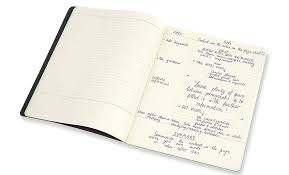
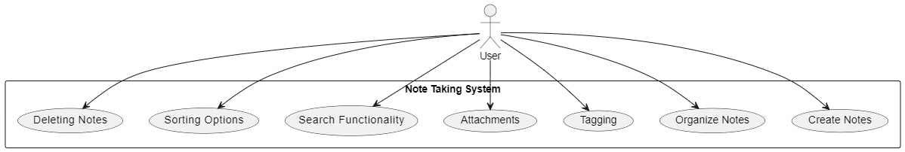

# MAKER'S NOTE TAKING APP

Welcome to the Note Taking App! This application allows users to create, organize, and manage their notes effortlessly. With features like note categorization, tags, attachments, reminders, and a user-friendly interface, managing your notes has never been easier.

## Features
Create Notes: Quickly create new notes with customizable titles and content.
Organize Notes: Categorize your notes for better organization and easier retrieval.
Tagging: Add tags to your notes for quick identification and filtering.
Attachments: Attach files or images to your notes for additional context or reference.
Search Functionality: Easily find specific notes using keywords or categories with the built-in search function.
Sorting Options: Sort your notes by date, title, or category for better organization.
deleteing notes: delete notes from your notes list.

## Technologies Used
- HTML
- CSS
- JavaScript
- Node.js
- Express.js
## Installation
`npm install`
git clone https://github.com/your-username/maker's-note-taking-app.git
## Navigate to the project directory:
`cd maker's-note-taking-app`
## Install dependencies:
pip install -r requirements.txt
## Run the Flask server:
`python app.py`
## Usage
-Create a new note by entering a title and content, then click "Add Note".
-Organize your notes using categories and tags.
-Attach files or images to your notes for additional context.
-Use the search functionality to quickly find specific notes.
-Set reminders for important notes to receive notifications.
-Delete notes from your notes list.
## Contributing
Contributions are welcome! If you have any suggestions, enhancements, or bug fixes, feel free to open an issue or submit a pull request.
## License
This project is licensed under the MIT license.
## Acknowledgements
Special thanks to ALX Team for providing inspiration and resources.